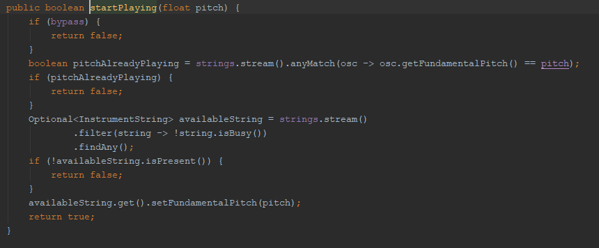

# Synthesizer

## About this app

The purpose of this app is to provide user with the ability to play music using computer's keyboard. The app plays sound by synthesizing different instruments, so the sound is produced at runtime - it's not playing pre-recorded sounds.

## Technologies used

* Java SE 9
* Java Sound API
* JavaFX
* Lombok

## Installation

### For developers

1. Download and install <i>Java Runtime Environment 9</i> and <i>Java Development Kit 9</i> from <a href="https://www.oracle.com/technetwork/java/javase/downloads/java-archive-javase9-3934878.html">here</a>.

2. Download an IDE that supports <i>Java</i> language and supports <i>Maven</i> project management tool, like <a href="https://www.jetbrains.com/idea/">Intellij IDEA</a>.

3. Clone this repo on your computer and make sure you're viewing the last commit on branch <i>master</i>.

4. Open project and right click on <i>pom.xml</i> file. Choose <i>Maven > Reimport</i>. Wait for <i>Maven</i> to download dependencies.

5. Search for class <i>app.Main</i> in folder <i>src/main/java</i>. Right click on it and choose <i>Run 'Main'</i>.

6. The app gui should appear.

### For simple users

1.  Download and install <i>Java Runtime Environment 9</i> from <a href="https://www.oracle.com/technetwork/java/javase/downloads/java-archive-javase9-3934878.html">here</a>.

2. Clone this repo on your computer and make sure you're viewing the last commit on branch <i>master</i>. 

3. You're only interested in the folder called <i>./synthesizer-app</i>. Open it and double click on <i>synthesizer.jar</i> file. It's possible that your OS doesn't know at this moment what to do with <i>.jar</i> files. You should open it with <i>Java Runtime Environment</i>. Another way to open the file is by opening a Command Prompt (Windows) / Terminal (Linux) in folder <i>./synthesizer-app</i> and running command <i>java -jar synthesizer.jar</i>.

4. The app gui should appear.

## Usage guide

When opening the app the user is prompted with this window: . The window, unfortunately, is not resizable.

There are two main panels:

1. The Pedalboard Panel (the top panel)

2. The Keyboard Panel (the bottom panel).

Let's talk about The Keyboard Panel first.

### The Keyboard Panel

The Keyboard Panel consists of one single component: an 88 notes piano keyboard representation. To interact with the keyboard use your PC's keyboard keys. Look on the image below. Only the white keys can be used to play sound.  2 and a half octaves can be enabled at a time. These octaves are shown in the app in white, while those unplayable are shown in grey.

 

Simply! Use:
* F10 to shift mapping to left with one octave
* F11 to shift mapping to right with one octave

Note: If the mapping cannot be shifted with one octave, it won't be shifted at all.

If the instrument is polyphonic (let polyphony = x), then it means you can play multiple notes at the same time (x notes).

### The Pedalboard Panel

Here we have 3 different pedals:

1. Intrument pedal
2. Envelope Shaper pedal
3. Distortion pedal

Use the controls (sliders, checkboxes, radio buttons etc.) to change pedals' properties. You can disable (bypass) / enable a pedal simply by pressing the <i>Power</i> / <i>Bypass</i> button on top of it: 

#### Instrument pedal

With this pedal you are able to change the instrument currently playing in the application. For this click on the combo-box. A drop-down list will appear, from where you can select the desired instrument.

Bypass-ing this pedal will prevent any interaction between the user and the piano keyboard in the bottom panel.

#### Envelope Shaper pedal

With this pedal you are able to change the envelope of the instrument.

In the real life, every instrument has a different envelope that gives it its characteristic sound (along with other factors, of course). For example an organ, when played, doesn't jump from no sound to its full amplitude. Instead, it takes a time, a really short time, for the amplitude to grow to that value. We call this time interval: <i>attack time</i>. Then, after the note reached its highest point of amplitude, the amplitude will decrease just a little. The time it takes for the amplitude to fade from the maximum point to a value of <i>x</i> is called <i>decay time</i>. Now, the organ will continue to play our note at a constant amplitude <i>x</i> until we release the key. We call that constant amplitude (x) <i>sustain amplitude</i>. After releasing the key, the amplitude of the note will decrease with a moderately speed (in case of an organ) to a value of "no sound". The time it takes to do that is called <i>release time</i>.

You can view what I just told you in the following image:

Now, let's take another instrument. For example, a guitar. The guitar is entirely different from an organ in terms of envelope. It has an attack time - but different from that of an organ - but it has no decay and no sustain, because as soon as you pick a guitar string the sound will start to fade out. So it has a quite long release time.

You can adjust these parameters of the instrument by dragging the sliders' thumbs, or by entering a value in the text fields right below the sliders.

Please note that the <i>sustain amp</i> is given in a range of -10dB to -1 dB. Why negative values? Because those values of amplitudes will be converted to positive values (like 50dB) only after they get through your PC's speakers. That's the role of the speakers: to amplify sound and make it audible to human ears.

By unchecking the <i>Has decay and sustain</i> checkbox the <i>decay time</i> and <i>sustain amp</i> parameters will not be taken into account.

This pedal cannot be bypassed because that would break the logic of the app.

#### Distortion pedal

At first, this pedal will be disabled. Enable it by pressing the <i>Bypass</i> button.

The effect has 3 different types or distortion strategies: <i>Soft</i>, <i>Normal</i> and <i>Hard</i>.

##### Soft Distortion Strategy

Most of the audio signal is composed out of multiple sine waves. What this strategy does is that it takes some sine waves, or composed sine waves, and flattens them using... math.

When using this type of distort you should be using only the <i>Post Gain</i> parameter. Setting it to 1 will create a very, very subtle distortion effect. That's the actual effect you should get from a <i>soft distort</i>. Setting it to more than 1 will make the wave to be cut so you would get a more aggressive effect, but a louder sound too.

##### Normal Distiortion Strategy

The same applies to this strategy, but using another math function.

##### Hard Distortion Strategy

This strategy is not really based on math functions. It uses, instead, a <i>threshold</i> (negative and positive). All the values above the positive or below the negative threshold will be cut out. Given the fact that some of the available instruments are using composed sine waves, where some of them have really small amplitudes, I have been forced to set the threshold really low - to 0.1 amplitude value out of 1 - in order to distort them, too. But by setting the threshold that low there will be a lot of lost gain, and we will not be able to hear the sound without turning the speaker up. In order to avoid that fact, we have the <i>Post Gain</i> control. After reducing the signal at 0.1 we obtain a 10 times softer sound, which has to be increased back 10 times.

So, the signal comes into the distortion pedal. All the values above our threshold of 0.1 are left out. That means, that if we want to keep all of our dry signal we will have to decrease it before distortion, 10 times. Here comes in the <i>Pre Gain</i> control. Set it to 0.1 to decrease the signal 10 times, before the distortion is applied. Then amplify it with <i>Post Gain</i> 10 times to get back the gain. That's how you actually avoid the effect.

Using this strategy (Hard Distortion), it is better to set the <i>post gain</i> at 10, and just play with the <i>pre gain</i> control.

## Code structure and flow

Below we have a main view over the app structure.

<i>Main</i> class extends <i>Application</i> class from <i>JavaFX</i>. It is responsible to load the User Interface. <i>MainController</i> gets all dependencies from <i>JavaFX</i> and then spreads them to the other controllers in the package. <i>PianoKeyboardController</i> is responsible with piano - user interaction. <i>InstrumentPedalController</i> sends request to the currently selected instrument or asks for another instrument to be loaded. <i>EnvelopeShaperPedalController</i> and <i>DistortionPedalController</i> are responsible for interaction with the effects.

Next, we have a graphical representation of how things go in <i>studio.instruments</i> package.

When the app is loaded, <i>MusicalInstrumentFactory</i> is asked to load into memory the <i>Blueprint</i>s from all available instruments. The blueprints are found in <i>src/main/resources/intruments</i> folder. A blueprint is an <i>.xml</i> file that looks like this:

<i>MusicalInstrumentFactory</i> asks <i>MusicalInstrumentBlueprintParser</i> to parse these <i>xml</i> files. Then, when the user chooses one of the instruments from the combobox - every element in the combobox being a <i>Blueprint</i> - factory's method <i>createFromBlueprint</i> will be called and a new instrument will be created, with all the necessary <i>InstrumentString</i>s and <i>WaveOscillator</i>s. The UI layer will only interact with a interface of the instrument.

Finally, let's see how the app works:

The user presses a key. Let it be an A note (440 hz). This event will be handled in this method from <i>PianoKeyboardController</i>.

This Controller will ask from <i>PianoKeyboardMapper</i> for the mapping table (a hash table) and if he finds that the key pressed is mapped to a note, then it will get access to the instrument loaded and it will ask it to start playing the associated pitch. Unfortunately, <i>JavaFX</i> fires the KEY_PRESSED event more than once. To avoid breaking the application logic, the instrument will return a boolean value if the note could be played or not. The note will not be played if it is already playing! Then we do some css/ui stuff to show on the piano which note is being played.

The above method is from <i>MusicalInstrumentImpl</i>. After making sure that the note is not already playing, we search for an available <i>InstrumentString</i> and if we find one, we assign to it the pitch of the note.

The <i>InstrumentString</i> class extends <i>Thread</i>. These "string threads" were started when the instrument was created. As long as there is nothing to play, the <i>InstrumentString</i> thread will wait. We just set an 440 hz frequency to the string (A note). That's different from NULL_PITCH (0.0hz), so we're going to notify the <i>InstrumentString</i> thread. We will start generating a buffer, start the effects and write to the sound card.

Given the fact that in real life the instruments are producing composed sine waves, we are going to use multiple oscillators, asking from each one to play a different harmonic. Then, we mix all the frequencies together and obtain a byte audio buffer.

The oscillators work like this:
* we create a buffer of a size multiple of SAMPLE_RATE;
* we find out where on Ox axis the sample is situated - that is <i>dT</i> or <i>elapsed time</i>
* we apply the function of the concrete oscillator

Here is some code from <i>EnvelopeShaper</i>. When started from <i>InstrumentString</i> thread, it will "attack", "decay" and "sustain" using the gain control from <i>java.sound</i>. When the user releases the A note key, an event will be fired, the instrument will be asked to <i>stopPlaying</i> the note, the string playing the note will be found and <i>setFundamentalPitch</i> will be called again. From there, the effects will be interrupted, making the envelope shaper to break from sustain and start "releasing". If the same note is pressed again, the <i>EnvelopeShaper</i> thread will be interrupted again and "mute" will occur, which will flush the <i>java.sound</i> buffer and the new note will be played following exactly the same process explained above.

## Conclusion
 Have fun!

